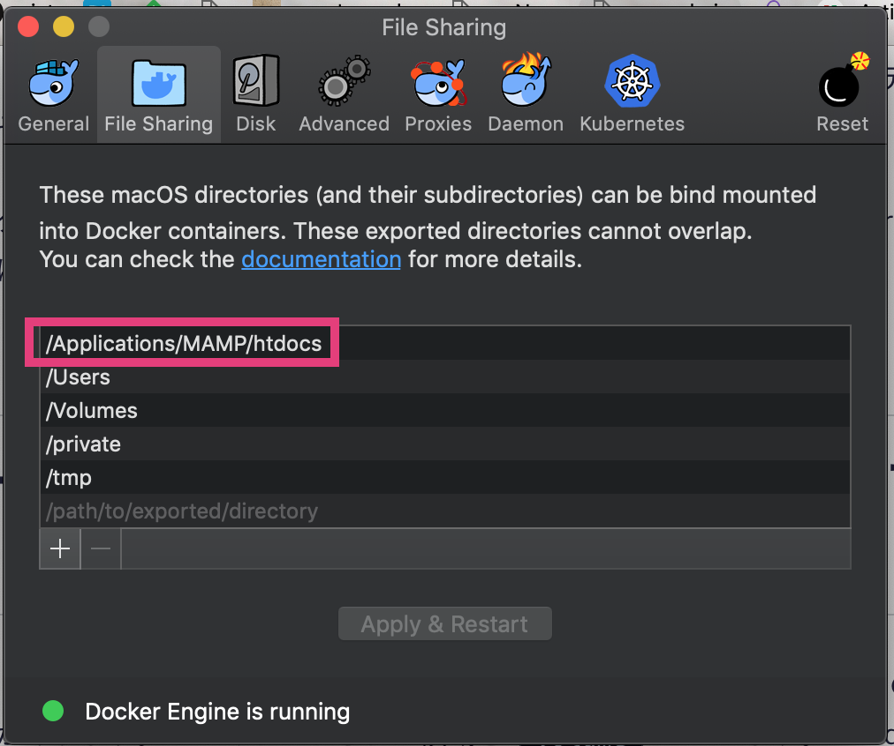

### テーマ開発ディレクトリを volume としてマウントする

`docker-compose.yml` の `volumes` に `{テーマ開発ディレクトリのパス}:{実際のWordPressのテーマの置き場}` として設定

```
  wordpress:
    depends_on:
      - db
    image: wordpress:latest
    ports:
      - '9000:80'
    restart: always
    environment:
      WORDPRESS_DB_HOST: db:3306
    env_file: .env
    volumes:
      - ./:/var/www/html/wp-content/themes/chabin
```

以下のようなエラーが出たら...

```
ERROR: for wordpress  Cannot start service wordpress: b'Mounts denied: \r\nThe path /Applications/MAMP/htdocs/chabin/wordpress/wp-content/themes/chabin\r\nis not shared from OS X and is not known to Docker.\r\nYou can configure shared paths from Docker -> Preferences... -> File Sharing.\r\nSee https://docs.docker.com/docker-for-mac/osxfs/#namespaces for more info.\r\n.'
ERROR: Encountered errors while bringing up the project.
```

Docker の `設定(Preference...)` の `File Sharing` で、テーマ開発ディレクトリを含むディレクトリを登録すると OK。


